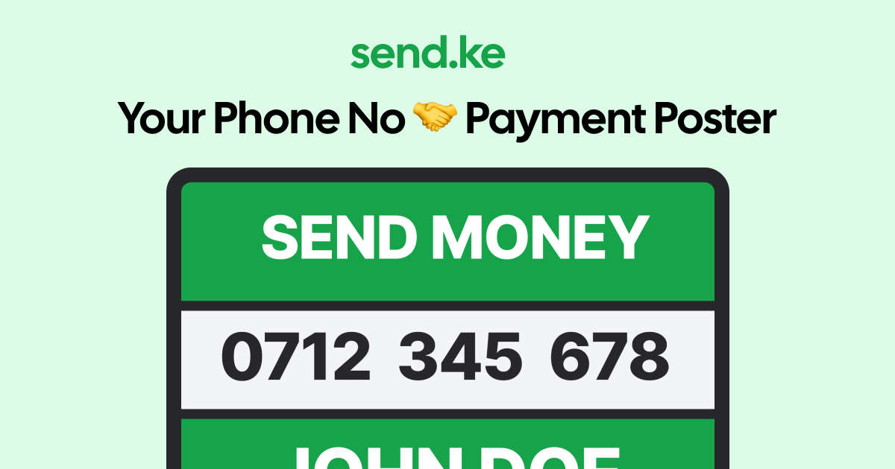

# send.ke

<p align="center">
  
</p>

## Make Mobile Payment Posters in Seconds

**send.ke** is a free, offline-capable web tool that lets you create beautiful payment posters with your phone number and name. Perfect for businesses, street vendors, freelancers, and anyone who needs to receive mobile payments.

## 🔗 [Visit send.ke](https://send.ke)

## ✨ Features

- **100% Free** - No hidden costs, no premium features
- **Works Offline** - Create posters even without an internet connection
- **No Account Required** - Just enter your details and download
- **Instant Downloads** - Get your poster in seconds
- **High-Quality Images** - Professional-looking posters every time
- **Mobile Friendly** - Works on all devices

## 📱 What is a Payment Poster?

A payment poster is a simple, effective way to display your mobile money details. Instead of complicated QR codes, customers just:

1. See your phone number
2. Send money directly to it
3. That's it!

Perfect for places where mobile money is popular but QR codes are not widely used.

## 🚀 How to Use

1. Enter your phone number
2. Enter your name
3. Click "GET YOUR MONEY POSTER"
4. Share the downloaded image:
   - Print it for your shop/stall
   - Share it on social media
   - Add it to your invoices
   - Send it via WhatsApp or other messaging apps

## 💻 Development

### Prerequisites

- Node.js 18+
- npm or yarn

### Installation

```bash
# Clone the repository
git clone https://github.com/DavidAmunga/sendke.git
cd sendke

# Install dependencies
npm install
# or
yarn

# Start development server
npm run dev
# or
yarn dev
```

### Building for Production

```bash
npm run build
# or
yarn build
```

## 🛠️ Technologies Used

- React
- TypeScript
- Vite
- Tailwind CSS
- html2canvas

## 📄 License

This project is open source and available under the [MIT License](LICENSE).

## 🤝 Contributing

Contributions, issues, and feature requests are welcome! Feel free to check the [issues page](https://github.com/DavidAmunga/sendke/issues).

## 👨‍💻 Author

**David Amunga**

- Website: [davidamunga.com](https://davidamunga.com)
- GitHub: [@DavidAmunga](https://github.com/DavidAmunga)

---

<p align="center">
  Made with ❤️ in Kenya
</p>
